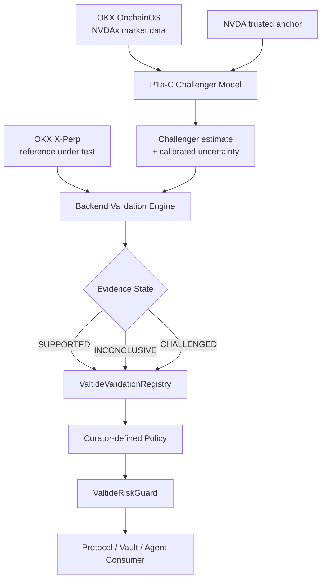
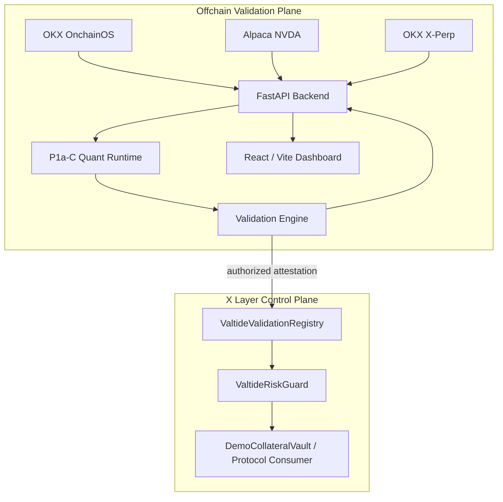

# Valtide

**Independent collateral-valuation control for tokenized equities on X Layer.**

Valtide helps DeFi curators and RWA risk teams independently validate whether a
collateral reference remains supported by market evidence, then makes that
Evidence State usable by curator-defined policies on X Layer.

[Live App](https://valtide-liard.vercel.app) · [Backend API](https://valtide-api-production.up.railway.app) · [OpenAPI / API Docs](https://valtide-api-production.up.railway.app/docs) · **Built for OKX Dev Day 2026 — Build a Market**

## Problem

Tokenized equities can continue trading while the strongest traditional equity
reference is closed, delayed, or degraded. During those periods:

- the last trusted underlying reference may become stale;
- tokenized venues may continue discovering prices;
- constructed references can disagree; and
- collateral valuation directly affects protocol risk.

The key question is not whether one feed is universally “correct”: it is
whether the collateral reference a protocol relies on remains supported by
independent market evidence.

## What Valtide Does

Valtide combines a quantitative challenger, point-in-time market evidence, and
backend validation into an auditable control path for tokenized-equity
collateral.

> **Valtide determines the Evidence State. The curator or protocol defines the
> Policy Action. The consumer enforces the resulting action.**

Evidence State is one of:

- `SUPPORTED` — available evidence does not provide a material reason to
  challenge the reference under test;
- `INCONCLUSIVE` — evidence is unavailable, stale, weak, or unresolved; or
- `CHALLENGED` — sufficiently strong evidence materially contradicts the
  reference under test.

The dashboard is the human interface for operational monitoring and historical
evidence. The machine interface is the X Layer ValidationRegistry and
RiskGuard. Policy mappings belong to the consuming curator or protocol; Valtide
does not prescribe a universal risk action.

## How It Works



The model and validation engine run offchain. The X Layer contracts store the
attestation, evaluate the configured policy, and expose a result that a
consumer can enforce. The contracts do not run the quant model, custody user
funds, or liquidate positions.

## Architecture



The P1a-C package owns challenger estimation, uncertainty, calibration
metadata, and carried state. The backend owns normalized snapshots, reference
selection, data-quality checks, Evidence State, reason codes, API delivery,
and publication orchestration. RiskGuard owns policy evaluation only; the
consumer owns enforcement.

## Live Deployment

| Component | Deployment |
|---|---|
| Frontend | [valtide-liard.vercel.app](https://valtide-liard.vercel.app) |
| Backend API | [valtide-api-production.up.railway.app](https://valtide-api-production.up.railway.app) |
| OpenAPI | [FastAPI docs](https://valtide-api-production.up.railway.app/docs) |
| Network | X Layer Testnet · Chain ID `1952` |

The deployed dashboard is read-only in the browser. Backend-controlled
publication is observed through the API; the publisher key is never exposed to
frontend code.

## X Layer Contracts

The current testnet control plane is recorded in
[`deployments/xlayer-testnet.json`](deployments/xlayer-testnet.json).

| Component | Address | Purpose |
|---|---|---|
| `ValtideValidationRegistry` | `0x1A53C85C66EA212693d36bF842574643C4d9B635` | Stores the latest authorized validation attestation |
| `ValtideRiskGuard` | `0x8e17a4eB93074ea74d05D9bc316d85AD3B540CE7` | Applies a consumer-owned Evidence State → Policy Action mapping |
| `DemoCollateralVault` | `0x4beC6Bc1DF651f36758216cA02db62b5603349ce` | Demonstrates reference-consumer enforcement |
| Authorized publisher | `0xBb341F8AE72146CEE60Ca0cCFE8C3Db5c90fC30C` | Publishes backend attestations on testnet |

These are testnet contracts and a reference consumer, not audited production
lending infrastructure. `evidenceHash` links an attestation to canonical
offchain evidence; it is a provenance commitment, not proof that the evidence
is objectively correct.

## Key Technical Properties

- **Exact operational observations** — the warmed live runtime uses confirmed
  five-minute OKX NVDAx candles at settled observation timestamps.
- **Point-in-time integrity** — historical replay prevents future-information
  leakage and preserves causal trusted anchors.
- **Explicit abstention** — unavailable, stale, weak, or conflicting evidence
  can produce `INCONCLUSIVE` rather than fabricated certainty.
- **Calibrated uncertainty** — P1a-C returns a challenger estimate with
  calibrated interval bounds, not only a point estimate.
- **Evidence / policy separation** — `Evidence State != Policy Action !=
  Enforcement`.
- **Fail-closed historical provenance** — Historical mode requires
  `X-Valtide-Source: historical_panel` before accepting panel replay as
  research evidence.
- **Persistent operational state** — the warmed scheduler persists carried
  state, results, gaps, and publication status in SQLite.
- **Independent chain delivery** — publisher failures are tracked separately
  from valuation state and do not replace an honest backend result.

## Local Development

```bash
git clone https://github.com/chin0312/valtide.git
cd valtide
cp .env.example .env
```

### Backend

```bash
cd apps/api
python -m venv .venv
source .venv/bin/activate
pip install -e ../../valtide-quant-service-p1ac -e ".[dev]"
uvicorn valtide_api.main:app --reload --port 8000
```

The local scheduler is disabled by default and publication is disabled by
default. Add only the credentials needed for the data path you are exercising.

### Frontend

```bash
cd apps/web
npm ci
printf 'VITE_API_BASE_URL=http://localhost:8000\n' > .env.local
npm run dev -- --host 127.0.0.1
```

The development dashboard is available at `http://127.0.0.1:5173`.

### Contracts

```bash
cd contracts
forge build
forge test -vvv
```

Deployment is separate from local development and requires explicitly supplied
testnet environment variables. Never commit private keys or RPC credentials.

## Testing

```bash
# Backend
python -m pytest apps/api/tests -q

# Quant
python -m pytest valtide-quant-service-p1ac/tests -q

# Frontend
cd apps/web
npm test
npm run typecheck
npm run build

# Contracts
cd ../../contracts
forge fmt --check
forge build
forge test -vvv
```

GitHub Actions runs the integrated backend, quant, frontend, quality/demo, and
contract checks.

## Repository Structure

```text
apps/api/                    FastAPI backend, adapters, scheduler, publisher
apps/web/                    Vite + React + TypeScript dashboard
valtide-quant-service-p1ac/  P1a-C runtime, calibration, artifacts, tests
contracts/                   X Layer Registry, RiskGuard, DemoVault, tests
deployments/                 public testnet deployment metadata
data/                        ignored generated panels and runtime state
scripts/                     diagnostics, panel-building, and demo utilities
docs/                        product, architecture, methodology, and deployment references
```

## Documentation

| Reference | Description |
|---|---|
| [Architecture](docs/ARCHITECTURE.md) | As-built system, trust boundaries, and module responsibilities |
| [Methodology](docs/METHODOLOGY.md) | Challenger model, uncertainty, evidence states, and evaluation |
| [Product Requirements](docs/PRD.md) | Product workflow, users, principles, and limitations |
| [Market Research](docs/USER_MARKET_RESEARCH.md) | User context, market landscape, and competitive infrastructure |
| [Backend Architecture](docs/BACKEND_ARCHITECTURE.md) | Runtime, data, scheduler, persistence, and API design |
| [Deployment](docs/DEPLOYMENT.md) | Hosted topology and reproducibility guidance |
| [Product Semantics](docs/PRODUCT_SEMANTICS.md) | Operational, Historical, Demo, policy, and publication boundaries |
| [Contract control plane](contracts/README.md) | Solidity interfaces, deployment, and trust boundaries |

## Team

| Member | GitHub | Role |
|---|---|---|
| Kai Ze | [@chin0312](https://github.com/chin0312) | Product, Smart Contracts & Systems Integration |
| Xin Tong | [@landonzhao](https://github.com/landonzhao) | Backend & API Engineering |
| James | [@Orange-eat97](https://github.com/Orange-eat97) | Quantitative Research & Product |
| Valerie | [@valeriexylim](https://github.com/valeriexylim) | Frontend Engineering & UI/UX Design |

- **Kai Ze** — product strategy and system design; X Layer smart contracts;
  cross-stack integration; frontend/backend integration; deployment and
  end-to-end delivery.
- **Xin Tong** — backend/API engineering, data adapters, backend implementation
  and runtime services.
- **James** — quantitative research, P1a-C model, uncertainty calibration and
  backtesting; contributed to early product design and demo framing.
- **Valerie** — frontend engineering, UI/UX design, interaction design and
  curator-facing product experience.

## Disclaimer

Valtide is a research and hackathon prototype. It is not a production oracle,
audited lending system, financial product, or financial advice.
