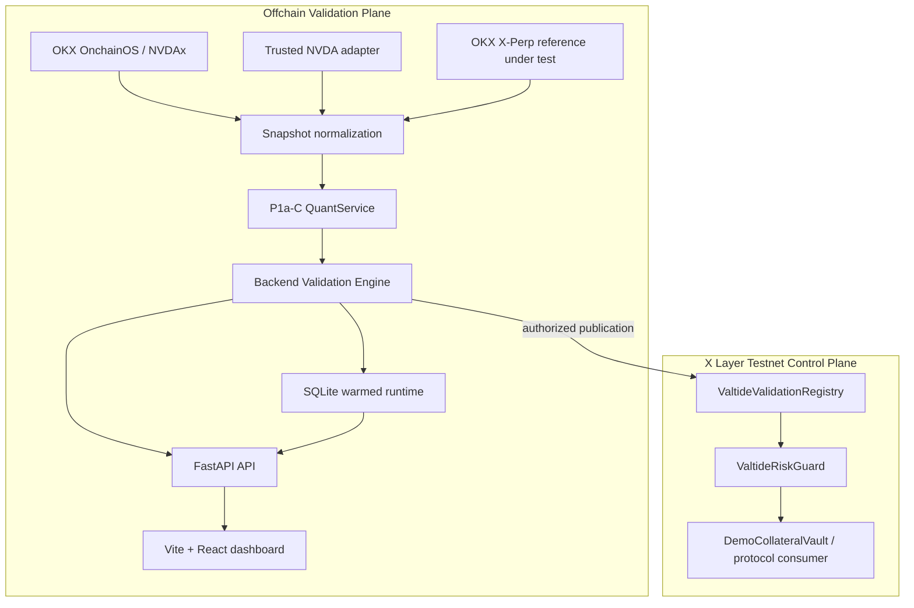

# Valtide — As-Built Architecture

**Status:** Public architecture reference

Valtide is an independent validation and control layer for tokenized-equity
collateral. It compares a reference under test with a challenger estimate and
independent market evidence, produces a backend-owned Evidence State, and
makes that state available to curator-owned policy controls on X Layer.

The system is deliberately split across two planes:

- the **offchain validation plane** performs market-data normalization,
  quantitative inference, validation, persistence, replay, and API delivery;
- the **X Layer control plane** stores authorized attestations, evaluates a
  consuming application's policy, and exposes a consumer-facing result.

Valtide determines Evidence State. The curator or protocol defines Policy
Action. The consumer enforces the resulting action.

## 1. System Boundary

The quantitative model remains offchain. Contracts do not calculate fair value,
recompute intervals, determine Evidence State, set universal LTVs, custody
assets, or liquidate positions.

The current supported product path is NVDAx with:

- OKX OnchainOS tokenized-market observations;
- trusted underlying NVDA observations from the configured equity adapter;
- OKX X-Perp as the reference under test in the live path;
- the packaged P1a-C challenger runtime;
- backend validation and reason codes; and
- the deployed X Layer Registry, RiskGuard, and DemoCollateralVault.

## 2. As-Built System Flow



The backend publisher is separate from valuation state. A publication failure
does not replace or invalidate a successfully persisted operational result.

## 3. Repository Topology

```text
apps/api/                    FastAPI backend, adapters, scheduler, publisher
apps/web/                    Vite + React + TypeScript dashboard
valtide-quant-service-p1ac/  P1a-C runtime, calibration, artifacts, tests
contracts/                   Registry, RiskGuard, DemoVault, scripts, tests
deployments/                 public testnet deployment metadata
data/                        ignored generated panels and runtime state
scripts/                     panel, demo, diagnostic, and smoke utilities
docs/                        product, architecture, methodology, and operations
```

## 4. Logical Components

### Data adapters and normalization

`apps/api/valtide_api/adapters/` converts provider-specific data into canonical
observations while preserving source identity, source timestamp, retrieval
context, units, market state, and quality information. `normalizer.py` applies
the shared token/underlying scale invariant. Vendor-specific response shapes do
not cross this boundary.

### P1a-C quantitative runtime

`valtide-quant-service-p1ac/` owns the challenger model runtime, calibrated
uncertainty, calibration metadata, model artifacts, and carried state. The
backend consumes its public `QuantService` interface and does not duplicate
model equations.

### Backend validation

`apps/api/valtide_api/validation.py` owns reference-under-test checks, data
quality gates, Evidence State, and reason codes. It preserves the distinction
between:

```text
challenger estimate
reference under test
independent evidence
Evidence State
```

`SUPPORTED`, `INCONCLUSIVE`, and `CHALLENGED` are evidence semantics, not
protocol recommendations.

### Replay and backtesting

`panel.py`, `scenario.py`, `replay.py`, and the backtest route share the same
normalization, sequential runtime, and validation boundaries. The canonical
runtime advances in exact five-minute steps. Missing token measurements are
represented as `token_price=None`, allowing state propagation without a
fabricated observation.

### Warmed live runtime

`scheduler.py` runs one in-process scheduler on canonical UTC five-minute
boundaries. `runtime_store.py` persists carried state, the latest result, gap
steps, scheduler status, and publication status in SQLite. Restart restores the
persisted state; a failed tick preserves the last good result.

`GET /api/valuation/{asset}` reads the latest warmed result. The `/live` route
is a cold-start diagnostic and does not mutate or replace the warmed state.

### API and dashboard

FastAPI exposes operational, historical, demo, runtime, backtest, and onchain
read paths. The Vite/React dashboard keeps Operational, Historical, and Demo
contexts explicit. It never calculates Evidence State or reason codes and never
holds a signer key.

## 5. Causal and Point-in-Time Integrity

At observation timestamp `t`:

```text
trusted anchor at t       = latest trusted underlying observation strictly before t
current underlying at t   = underlying observation at t, when current enough
challenger at t            = computed before assimilating current underlying at t
```

Historical replay establishes an anchor from prior data and advances the
quant state through exact five-minute transitions. The current underlying
observation cannot initialize the same timestamp's challenger state.

Historical panel construction may use a causal lookback to establish an
anchor, but output rows remain inside the requested interval. Weekend and
overnight rows preserve a stale trusted anchor without forward-filling it as a
current measurement.

## 6. Canonical Data Paths

| Path | Source of truth | Meaning |
|---|---|---|
| `/api/valuation/{asset}` | warmed SQLite runtime | latest operational result |
| `/api/valuation/{asset}/live` | live adapters | cold-start diagnostic |
| `/api/history/{asset}` | persisted successful ticks | operational history |
| `/api/replay/{asset}?source=panel` | historical panel | causal research replay |
| `/api/replay/{asset}?source=scenario` | backend scenario / Demo fixture fallback | six-observation deterministic Demo |
| `/api/backtest/{asset}?source=historical` | historical panel | MAE, RMSE, coverage, and state metrics |
| `/api/runtime/{asset}` | SQLite runtime | scheduler and publication status |
| `/api/onchain/{asset}` | Registry/RiskGuard reads | current deployed control-plane state |
| `/api/onchain/{asset}/enforcement` | DemoVault read-only check | reference-consumer enforcement result |

Historical replay exposes `X-Valtide-Source: historical_panel`; the deployed
frontend fails closed if the expected provenance cannot be verified. Reads do
not publish attestations.

## 7. Frontend Contexts

The dashboard uses the same risk-control language across three explicit lanes:

- **Operational** — latest warmed result, runtime status, operational history,
  current Registry/RiskGuard synchronization, and current enforcement;
- **Historical** — panel observations and historical diagnostics, with current
  policy shown as a counterfactual mapping rather than historical chain state;
- **Demo** — six canonical scenario observations and policy projection, never
  represented as deployed X Layer history.

Operational observation recency, reference-source lag, trusted-anchor age, and
onchain attestation freshness remain separate concepts. Current onchain state
is not rewritten to match a selected prior, historical, or scenario observation.

## 8. X Layer Control Plane

The contracts implement a thin machine interface:

### `ValtideValidationRegistry`

Stores the latest authorized attestation for an `assetId` and `referenceId`
pair. It stores reference price, challenger value and bounds, deviation,
Evidence State, provenance hash, model version, observation time, publication
time, and validity. Publication ordering uses `observedAt`; the contract does
not recompute offchain model outputs.

### `ValtideRiskGuard`

Stores policies scoped by consuming application, asset, and reference. It maps
the Registry Evidence State to a Policy Action and applies both Registry
validity and the policy owner's `maxAge` to freshness. Missing attestations are
explicitly distinguishable from stale attestations.

### `DemoCollateralVault`

Reads RiskGuard for its own policy and demonstrates consumer enforcement for a
new-exposure request. It is not a lending protocol, does not custody tokens,
and does not calculate LTV or liquidate positions.

The deployed testnet addresses are recorded in
[`deployments/xlayer-testnet.json`](../deployments/xlayer-testnet.json) and
documented in [`contracts/README.md`](../contracts/README.md).

## 9. Deployment Topology

The current hosted topology is:

```text
Vercel static Vite dashboard
        ↓ HTTPS / CORS
one Railway service
  one Uvicorn process
  in-process scheduler
  persistent /data volume
        ↓ RPC
X Layer Testnet contracts
```

The Docker image installs the packaged quant service and API. Railway runs one
replica with a `/health` healthcheck and a persistent SQLite path. The
deployment guide records environment-variable names, safety boundaries, and
read-only smoke checks without exposing secret values.

## 10. Failure and Safety Semantics

- Missing, stale, weak, or conflicting evidence can produce `INCONCLUSIVE`.
- Missing token observations advance state without fabricating a token price.
- Missing reference-under-test data remains explicitly unavailable.
- A missing or stale Registry attestation is not treated as `SUPPORTED`.
- Publisher failure is separate from valuation failure.
- Historical provenance failure is not silently replaced by Demo.
- The browser cannot publish, sign, custody funds, or modify curator policy.
- The system does not claim a universal correct price, production oracle,
  audited lending protocol, liquidation engine, or mainnet deployment.

## 11. Versioning and Provenance

Model artifacts and their provenance remain under
`valtide-quant-service-p1ac/`. Public X Layer deployment metadata remains under
`deployments/`. The backend exposes model/version and source-provenance fields
through API responses so a displayed result can be traced to its data and
runtime context.

## 12. Architecture Principle

> Keep the challenger independent, keep disagreement visible, keep historical
> replay point-in-time correct, and keep the protocol interface strong without
> moving statistical computation onchain.
